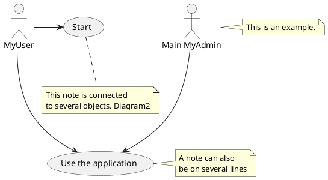

# Title 1

A text with **bold** character

A paragragraph on muliple lines
a paragraph on multiple lines
a paragraph on multiple lines



Lines break

Adn *empthasis*

a mixed **bold** `character` paragraph ***bold emphasis***


## Title 2

* item1
* item2
* item3

```python
test
```

1. numero1
2. nuemro2

!!Workflow: test2.puml

* level1
    * level 1-1
    * level 1-2
* level 2
* level 3
    * level 3-1
    * level 3-2

